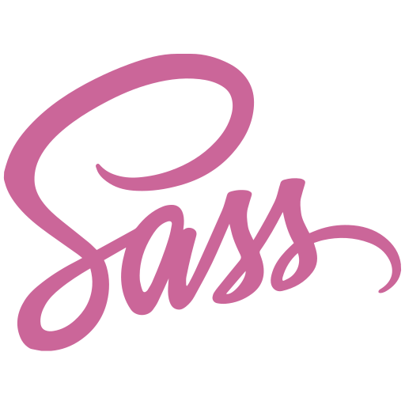
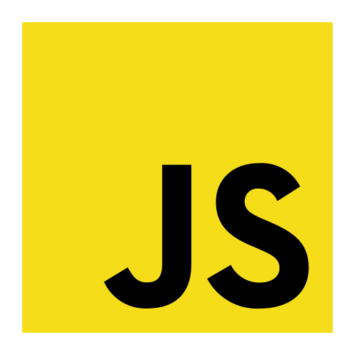
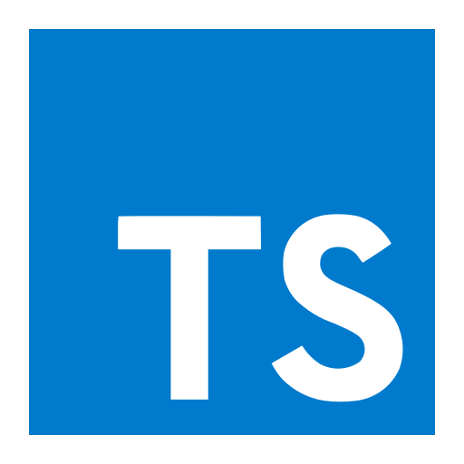
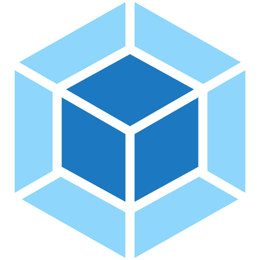

### Hi there 👋, I'm Veronika

## I am learning front end development.
- 💪 I like programming
- 💻 I like to develop my skills and learn new things
- 🎉 My goal is to become an experienced and skilled Frontend Developer.

### Connect with me:
- __Phone:__ +37525 696 84 03 
- __E-mail:__ smeyun@list.ru
- __Discord:__ Veronika2811#1463

### Languages and Tools:

 

 
 

[CV Veronika Smiayun](https://veronika2811.github.io/Veronika2811/)